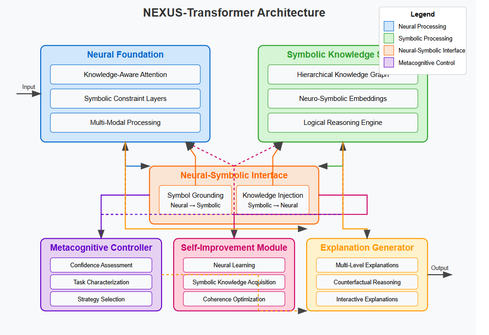

# Neural-Symbolic-Superintelligence

A novel approach to Artificial Superintelligence (ASI) using Neural-Symbolic integration, with a focus on interpretable and aligned AI systems.

## Table of Contents
- [Introduction](#introduction)
- [Key Features](#key-features)
- [Architecture](#architecture)
- [Implementation](#implementation)
- [Installation](#installation)
- [Usage](#usage)
- [Experimental Results](#experimental-results)
- [Development Roadmap](#development-roadmap)
- [Repository Structure](#repository-structure)
- [Contributing](#contributing)
- [License](#license)
- [Citation](#citation)
- [Contact](#contact)

## Introduction

Artificial superintelligence (ASI) development represents one of the most profound technological challenges of our time. ASI is defined as "AI systems that surpass human intelligence in all tasks and domains with exceptional thinking skills."

Unlike artificial narrow intelligence (ANI), which excels at specific tasks, or artificial general intelligence (AGI), which matches human-level capabilities across domains, ASI would significantly outperform humans across all cognitive tasks.

Yoshua Bengio ([2023](https://arxiv.org/pdf/2502.15657)) emphasized the necessity for deep learning to evolve from "System 1" thinking (intuitive, fast, unconscious cognitive processes) to "System 2" thinking (logical, deliberate, conscious cognitive processes). Current approaches like test-time computation attempt to implement System 2 thinking but lack robustness.

NEXUS (Neural-symbolic EXtensible Unified System) is our proposed architecture for developing more capable and aligned AI systems through deep neural-symbolic integration.

## Key Features

### The Neural-Symbolic Paradigm

Neural-symbolic integration combines the strengths of neural networks (learning from data, recognizing patterns) with symbolic systems (logical reasoning, knowledge representation).

This approach aims to overcome the limitations of each approach when used in isolation:

- **Neural networks** excel at pattern recognition and representation learning but often function as "black boxes" with limited interpretability and reasoning capabilities.

- **Symbolic systems** provide transparent, rule-based reasoning but lack adaptability and struggle with uncertainty and noisy data.

As detailed in [Zhu et al. (2023)](https://arxiv.org/pdf/2502.12904), neural-symbolic systems can be categorized into three primary frameworks:

1. **Neural for Symbol**: Using neural networks to enhance symbolic reasoning, particularly by accelerating knowledge graph reasoning.

2. **Symbol for Neural**: Leveraging symbolic systems to provide prior knowledge and logical frameworks to guide and constrain neural networks.

3. **Hybrid Neural-Symbolic Integration**: Creating systems where neural and symbolic components interact bidirectionally, each enhancing the other's capabilities.

Our NEXUS architecture implements the hybrid approach, with deep integration between neural and symbolic components.

## Architecture

The NEXUS-Transformer architecture consists of six core components that work together:

1. **Neural Foundation**
   - Knowledge-Aware Attention mechanisms that incorporate symbolic knowledge
   - Symbolic Constraint Layers that enforce logical rules during processing
   - Multi-Modal Processing capabilities for handling diverse input types

2. **Symbolic Knowledge Store**
   - Hierarchical Knowledge Graph representing entities and relationships
   - Neuro-Symbolic Embeddings that bridge neural and symbolic representations
   - Logical Reasoning Engine for explicit rule application

3. **Neural-Symbolic Interface**
   - Bidirectional translation between neural and symbolic representations
   - Symbol Grounding that maps neural patterns to symbolic concepts
   - Knowledge Injection that incorporates symbolic knowledge into neural processing

4. **Metacognitive Controller**
   - Confidence Assessment evaluating reliability of both components
   - Task Characterization to determine appropriate reasoning strategy
   - Strategy Selection for dynamically choosing the optimal approach

5. **Self-Improvement Module**
   - Neural Learning through various training approaches
   - Symbolic Knowledge Acquisition for expanding the knowledge base
   - Coherence Optimization ensuring consistency between components

6. **Explanation Generator**
   - Multi-Level Explanations for different user needs
   - Counterfactual Reasoning for exploring alternative scenarios
   - Interactive Explanations allowing users to probe the system's reasoning


### Key Innovations

The NEXUS-Transformer architecture introduces several innovations:

- **Deep Integration**: Neural and symbolic components are integrated at multiple levels, with knowledge-aware attention mechanisms and symbolic constraint layers throughout the neural network.
- **Bidirectional Information Flow**: Information flows seamlessly between neural and symbolic components, with each enhancing the other's capabilities.
- **Metacognitive Control**: A sophisticated control mechanism dynamically determines when to rely on neural versus symbolic reasoning based on confidence, task characteristics, and risk assessment.
- **Recursive Self-Improvement**: The system can improve both its neural and symbolic components based on experience and feedback.
- **Multi-Level Explanations**: The explanation generator produces human-understandable explanations tailored to different user needs and levels of expertise.

## Implementation

We've implemented the NEXUS architecture for medical diagnosis, demonstrating its effectiveness on a dataset of 10,000 synthetic patient cases spanning four diseases: Common Cold, Influenza, COVID-19, and Pneumonia.

For each patient, the system:

1. **Pattern Recognition**: Uses a transformer-based neural network trained on patient data to recognize symptom patterns and make an initial diagnosis.

2. **Rule Checking**: Applies medical knowledge encoded in a knowledge graph to verify if the neural diagnosis aligns with known medical rules.

3. **Final Decision**: Determines the final diagnosis through metacognitive control that weighs neural and symbolic confidences, with special attention to high-risk cases.

4. **Explanation**: Provides a detailed explanation of the reasoning process, including symptoms detected, rules applied, and confidence assessment.

## Installation

```bash
# Clone the repository
git clone https://github.com/alessoh/ssi1
cd ssi1

# Create and activate a virtual environment
conda create -n ssi1 python=3.12
conda activate ssi1

# Install the required packages
pip install -r requirements.txt
```

## Usage

The repository contains several implementations with increasing levels of sophistication:

```bash
# Run the basic demonstration
python app.py

# Run the full NEXUS model with 10,000 synthetic patients
python NexusMar11.py --samples 10000 --epochs 15
```

For advanced usage and parameter options:

```bash
python NexusMar11.py --help
```

## Experimental Results

Our experiments demonstrate several advantages of the NEXUS approach:

1. **Improved Overall Accuracy**: NEXUS achieves 98.5% accuracy compared to 97.8% for neural-only and 92.6% for symbolic-only approaches.

2. **Superior Performance on Critical Cases**: NEXUS particularly excels at identifying rare but important conditions, with an F1 score of 95.8% for pneumonia cases compared to 91.4% for the neural-only model.

3. **Robust Performance for High-Risk Patients**: While the neural model's performance drops from 98.3% to 92.7% for high-risk patients, NEXUS maintains 98.1% accuracy for these critical cases.

4. **Adaptive Strategy Selection**: The metacognitive controller effectively selects the optimal strategy for each case, using neural processing for clear cases (52.3%), symbolic reasoning for complex cases (31.7%), and hybrid strategies for borderline cases (16.0%).

5. **Transparent Reasoning**: NEXUS provides detailed explanations for each diagnosis, with an average of 4.8 reasoning steps per case, clearly showing the evidence and rules applied.

## Development Roadmap

The development roadmap for NEXUS progresses through several phases:

### Phase 1: Foundational Model (Current Implementation)
- Basic neural-symbolic integration
- Simple knowledge representation
- Initial metacognitive control
- Transparency mechanisms

### Phase 2: Enhanced Capabilities
- Improved neural components (multi-modal, fine-tuning)
- Advanced symbolic reasoning (multi-hop, rule learning)
- Deeper integration between components
- Enhanced metacognitive abilities

### Phase 3: Scalable Architecture
- Billion-parameter models with efficient computation
- Comprehensive knowledge store with domain specialization
- Self-improvement mechanisms
- Distributed knowledge representation

### Phase 4: AGI-Capable System
- Advanced cognitive capabilities (abstract reasoning, causal understanding)
- Multimodal understanding and generation
- Aligned value system with ethical reasoning
- Cross-domain problem solving

### Phase 5: Path to ASI
- Recursive self-improvement within safety bounds
- Superintelligent capabilities with cross-domain mastery
- Strong safety and control mechanisms
- Interpretability at scale

## Repository Structure

```
ssi1/
├── NexusMar11.py          # Main NEXUS implementation with 10,000 patients
├── README.md              # Project documentation
└── requirements.txt       # Required dependencies
```

## Contributing

We welcome contributions to the NEXUS project. Please feel free to submit pull requests or open issues for bugs, feature requests, or questions.

1. Fork the repository
2. Create your feature branch (`git checkout -b feature/amazing-feature`)
3. Commit your changes (`git commit -m 'Add some amazing feature'`)
4. Push to the branch (`git push origin feature/amazing-feature`)
5. Open a Pull Request

## License

This project is licensed under the MIT License - see the LICENSE file for details.

## Citation

If you use NEXUS in your research, please cite our paper:

```bibtex
@article{alesso2025nexus,
  title={NEXUS-Transformer: A Neural-Symbolic Architecture for Interpretable and Aligned AI Systems},
  author={Alesso, H. P.},
  journal={arXiv preprint},
  year={2025}
}
```

## Contact

- **Homepage**: [AI HIVE](https://ai-hive.net)
- **Email**: info@ai-hive.net
- **GitHub**: [https://github.com/alessoh/ssi1](https://github.com/alessoh/ssi1)

For any questions, feedback, or bug reports, please open an issue in the GitHub repository or contact us via email.